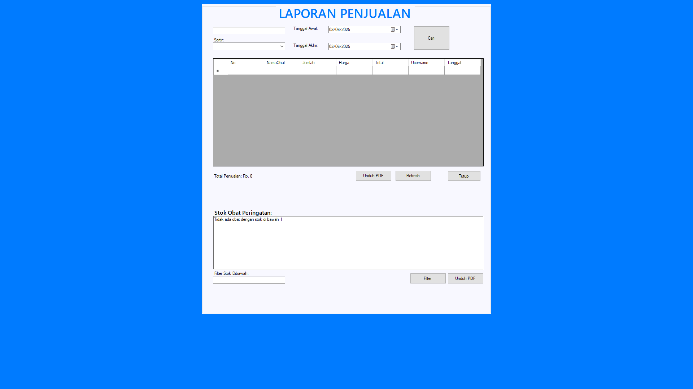

# MF POS - Sistem Kasir Apotek




> Sistem Point of Sale (POS) khusus apotek dengan manajemen stok otomatis, laporan penjualan, dan ekspor PDF.

## 🚀 Fitur Utama

### 📦 Modul Inti
- **Transaksi Kasir**  
  - Input obat via barcode scanner/keyboard  
  - Perhitungan otomatis subtotal & total  
  - Pencatatan transaksi ke database  

### 💊 Manajemen Obat
- Tambah/Edit/Hapus data obat  
- Peringatan stok rendah & kadaluarsa  
- Riwayat update stok  

### 📊 Laporan & Analitik
- Laporan harian/bulanan penjualan  
- Ekspor ke PDF (menggunakan iTextSharp)  
- Grafik stok obat (Chart.js)  

### 🔒 Keamanan
- Login multi-user  
- Blokir akses sistem (Alt+F4, Alt+Tab)  
- Audit log aktivitas user  

## 🛠️ Teknologi
- **Bahasa**: VB.NET (.NET Framework 4.7+)  
- **Database**: SQLite (embedded)  
- **PDF Export**: iTextSharp  
- **Dependensi Lain**:  
  - [Dapper](https://github.com/DapperLib/Dapper) - Micro ORM  
  - [BCrypt.Net](https://github.com/BcryptNet/bcrypt.net) - Password hashing  

## 📥 Instalasi
### Persyaratan
- Windows 10/11  
- .NET Framework 4.7+  
- SQLite Runtime (termasuk dalam paket)  

### Langkah-langkah
1. Clone repo:
   ```bash
   git clone https://github.com/leonxlab/MF-POS.git```
2. Buka solusi di Visual Studio 2019+
3. Build solusi `(Ctrl+Shift+B)`
4. Jalankan `MF_POS.exe` dari folder `bin/Release`

## 🎨 Struktur Projek
```bash
MF_POS/
├── Database/           # File SQLite dan skema
├── Forms/              # Semua form aplikasi
│   ├── KasirForm.vb    # Modul transaksi
│   ├── LaporanForm.vb  # Laporan penjualan
│   └── ...             
├── Modules/            # Modul utilitas
│   ├── Auth.vb         # Autentikasi user
│   ├── DBHelper.vb     # Koneksi database
│   └── ...
└── app.config          # Konfigurasi aplikasi
```

## 🧑‍💻 Penggunaan
# Login
```bash
Username: admin
Password: admin (ubah setelah instalasi!)
```
# Shortcut Penting
| Kombinasi        | Aksi                    |
|------------------|-------------------------|
| `Enter`          | ✅ Selesaikan transaksi  |
| `Backspace`      | ❌ Hapus item terakhir   |
| `Ctrl + P`       | 🖨️ Cetak struk           |

## 🛠️ Customisasi
# Ubah Tema Warna
Edit `Styles.vb:`
```vb
Public Class AppColors
    Public Shared Primary As Color = Color.FromArgb(0, 123, 255) 'Biru
    Public Shared Danger As Color = Color.FromArgb(220, 53, 69)  'Merah
End Class
```
# Tambah Kolom Database
1. Buka Database/apotek.db dengan [DB Browser for SQLite](https://sqlitebrowser.org/)
2. Jalankan query:
```sql
ALTER TABLE Obat ADD COLUMN ExpiryDate TEXT;
```

## 🤝 Berkontribusi
1. Fork proyek ini
2. Buat branch fitur `(git checkout -b fitur/namafitur)`
3. Commit perubahan `(git commit -m 'Tambahkan fitur X')`
4. Push ke branch `(git push origin fitur/namafitur)`
5. Buat Pull Request

## 📜 Lisensi
Proyek ini dilisensikan di bawah MIT License.


Dikembangkan oleh LeonXlab
[GitHub](https://github.com/leonxlab) | [Portfolio](https://leonxlab.github.io)


